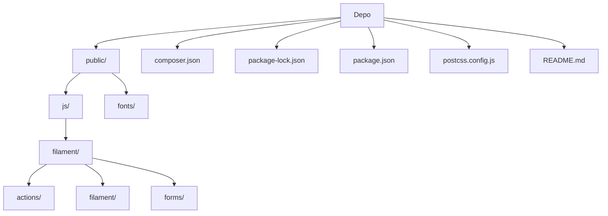

# Birlikte Kardeşlik Derneği Web Platformu

## İçindekiler
* [Özet](#özet)
* [Özellikler](#özellikler)
* [Gereksinimler](#gereksinimler)
* [Kurulum ve çalıştırma](#kurulum-ve-çalıştırma)
* [Yapılandırma](#yapılandırma)
* [Kullanılan teknolojiler](#kullanılan-teknolojiler)
* [Mimari ve klasör yapısı](#mimari-ve-klasör-yapısı)
* [API veya uç noktalar](#api-veya-uç-noktalar)
* [Test ve kalite](#test-ve-kalite)
* [Dağıtım ve üretim notları](#dağıtım-ve-üretim-notları)
* [Katkıda bulunma](#katkıda-bulunma)
* [Lisans](#lisans)

## Özet
Bu proje, Birlikte Kardeşlik Derneği için geliştirilmiş, kapsamlı bir web platformudur. Dinamik bir yapıya sahip olan uygulama, derneğin web sitesi ve yönetim panelini tek bir Laravel 11 çatısı altında birleştirir. Platform, tamamen admin panelinden yönetilebilir içerikler sunarak dernek faaliyetlerinin kolayca güncellenmesini sağlar. Hedef kullanıcı kitlesi, dernek üyeleri, gönüllüler ve bağışçılar olup, platform onların dernekle etkileşimini kolaylaştırmayı amaçlar. Ana işlevleri arasında duyuru ve proje yönetimi, online bağış kabulü ve gönüllü başvuruları bulunur.

## Özellikler
*   **Dinamik Yönetim Paneli:** Laravel Filament ile geliştirilmiş, kullanıcı dostu ve tam Türkçeleştirilmiş yönetim paneli.
*   **Genel Ayarlar Yönetimi:** Site başlığı, logo, favicon, iletişim ve sosyal medya bilgileri gibi tüm genel ayarların panelden kolayca güncellenebilmesi.
*   **Esnek İçerik Yönetimi:** Dinamik menüler, hero slider (ana sayfa görsel döngüsü), sayfalar, projeler, haberler ve banka hesaplarının yönetim panelinden eklenebilir/düzenlenebilir olması.
*   **Bağış Sistemi:** Kolay erişimli bağış sayfası ve IBAN kopyalama iş akışı ile online bağışları destekler.
*   **İletişim Formu:** Kullanıcı iletişim formundan gönderilen mesajların veritabanına kaydedilmesi, yönetim paneline düşmesi, yöneticiye bildirim e-postası ve başvuru sahibine otomatik bilgilendirme e-postası gönderimi.
*   **Gönüllü Başvuru Formu:** Dinamik olarak yönetilebilen tercih listeleri içeren gönüllü başvuru formu; başvuruların veritabanına kaydedilmesi, panelde görüntülenmesi ve yönetici tarafından gönüllü adaya e-posta ile cevap gönderimi.
*   **Admin Aktivite Kayıtları:** Yönetici paneli üzerindeki tüm giriş/çıkış, gezinme ve model değişikliklerinin detaylı olarak loglanması, filtrelenmesi ve dışa aktarılabilmesi.
*   **Rol Bazlı Yetkilendirme:** `super_admin`, `editor` ve `viewer` gibi farklı rollerle yetki seviyelerinin belirlenebilmesi.
*   **Çok Dilli Arayüz Desteği:** Yönetim panelinin ve kullanıcı arayüzünün tam Türkçeleştirilmesi.
*   **E-posta Entegrasyonu:** PHPMailer kütüphanesi aracılığıyla SMTP üzerinden güvenli e-posta gönderimi.
*   **Görsel Materyal Yönetimi:** Site genelindeki görsel materyallerin (örneğin fontlar ve JavaScript dosyaları) `public` klasörü altında düzenli bir şekilde saklanması.
*   **Güvenli Şifreleme:** Gerekli yerlerde veri şifreleme ve güvenli iletişim protokolleri kullanımı.

## Gereksinimler
Projenin düzgün bir şekilde çalışabilmesi için aşağıdaki yazılım gereksinimleri karşılanmalıdır:

*   **PHP:** Sürüm 8.2 veya üzeri.
*   **Node.js:** Sürüm 18.0.0 veya üzeri (Frontend bağımlılıkları için).
*   **MySQL:** Herhangi bir sürüm (Yerel veya canlı ortamda veritabanı desteği için).

## Kurulum ve çalıştırma
Yerel geliştirme ortamınızda projeyi ayağa kaldırmak için aşağıdaki adımları takip edin:

1.  **Depoyu klonla**
    ```bash
    git clone https://github.com/Burakgul3085/birliktekardeslik.git
    cd birliktekardeslik
    ```

2.  **Bağımlılıkları yükle**
    ```bash
    composer install
    npm install
    ```

3.  **Ortam dosyası ve uygulama anahtarı**
    ```bash
    cp .env.example .env
    php artisan key:generate
    ```

4.  **Veritabanı ayarları**
    `.env` dosyası içinde MySQL bağlantı bilgilerinizi düzenleyin:
    ```env
    DB_CONNECTION=mysql
    DB_HOST=127.0.0.1
    DB_PORT=3306
    DB_DATABASE=birliktekardeslik
    DB_USERNAME=root
    DB_PASSWORD=root
    DB_CHARSET=utf8mb4
    DB_COLLATION=utf8mb4_unicode_ci
    ```

5.  **Migration ve depolama linki**
    ```bash
    php artisan migrate
    php artisan storage:link
    ```

6.  **Frontend derleme**
    ```bash
    npm run dev
    ```

7.  **Uygulamayı çalıştırma**
    ```bash
    php artisan serve
    ```

Yönetim paneline `http://127.0.0.1:8000/admin` adresinden erişebilirsiniz. İlk yönetici kullanıcıyı oluşturmak için:
```bash
php artisan make:filament-user
```

## Yapılandırma
`.env` dosyası, uygulamanın çeşitli ortam değişkenlerini barındırır. Aşağıdaki tabloda önemli yapılandırma değişkenleri listelenmiştir:

| Değişken                  | Açıklama                                       | Zorunlu     |
| :------------------------ | :--------------------------------------------- | :---------- |
| `DB_CONNECTION`           | Veritabanı sürücüsü (ör. `mysql`)             | Evet        |
| `DB_HOST`                 | Veritabanı sunucusunun adresi                  | Evet        |
| `DB_PORT`                 | Veritabanı sunucusunun portu                   | Evet        |
| `DB_DATABASE`             | Kullanılacak veritabanının adı                 | Evet        |
| `DB_USERNAME`             | Veritabanı kullanıcı adı                       | Evet        |
| `DB_PASSWORD`             | Veritabanı parolası                            | Evet        |
| `PHPMAILER_HOST`          | SMTP sunucu adresi (ör. `smtp.gmail.com`)      | Evet        |
| `PHPMAILER_PORT`          | SMTP sunucu portu (ör. `587`)                  | Evet        |
| `PHPMAILER_ENCRYPTION`    | SMTP şifreleme türü (ör. `tls`)                | Evet        |
| `PHPMAILER_USERNAME`      | SMTP kullanıcı adı (e-posta adresi)            | Evet        |
| `PHPMAILER_PASSWORD`      | SMTP parola (uygulama_sifresi önerilir)        | Evet        |
| `PHPMAILER_FROM_ADDRESS`  | Giden e-postaların gönderen adresi             | Evet        |
| `PHPMAILER_FROM_NAME`     | Giden e-postaların gönderen adı                | Evet        |

## Kullanılan teknolojiler
*   **Backend:** PHP 8.2+
*   **Framework:** Laravel 11
*   **Yönetim Paneli:** Filament (5.6+)
*   **Veritabanı:** MySQL
*   **Frontend:** Tailwind CSS, Alpine.js, Vite
*   **E-posta:** PHPMailer (7.0+)
*   **QR Kod:** endroid/qr-code (6.1+)
*   **Gerçek Zamanlı İletişim (varsayılan):** Pusher JS (7.6.0)
*   **Klavye Kısayolları:** Mousetrap JS

## Mimari ve klasör yapısı
Proje, Laravel'in standart mimarisine uygun olarak organize edilmiştir. Frontend için derlenen varlıklar `public` dizini altında bulunur. Bu yapı, hem geliştirme kolaylığı hem de dağıtım verimliliği sağlamak üzere tasarlanmıştır. `public/js` dizini, uygulamanın dinamik davranışlarını sağlayan JavaScript dosyalarını barındırırken, `public/fonts` ise özel fontların tutulduğu yerdir.

| Bölüm / klasör            | Kısa açıklama                                         |
| :----------------------- | :---------------------------------------------------- |
| `public/`                | Uygulamanın statik varlıkları (CSS, JS, resimler vb.) |
| `public/js/`             | Frontend JavaScript dosyaları                         |
| `public/js/filament/`    | Filament yönetim paneline ait JavaScript modülleri    |
| `public/js/filament/actions/` | Filament eylemleri için JS dosyaları                  |
| `public/js/filament/filament/` | Filament çekirdek uygulaması ve gerçek zamanlı servis JS'leri |
| `public/js/filament/forms/` | Filament form bileşenleri için JS dosyaları           |
| `public/fonts/`          | Uygulamada kullanılan web fontları                    |
| `composer.json`          | PHP bağımlılıkları ve proje meta verileri             |
| `package-lock.json`      | Node.js bağımlılıklarının kilitli sürümleri          |
| `package.json`           | Node.js bağımlılıkları ve scriptleri                  |
| `postcss.config.js`      | PostCSS yapılandırma dosyası                          |
| `README.md`              | Proje hakkında genel bilgiler                         |



## API veya uç noktalar
Proje, web sitesi ve yönetim paneli işlevselliğini sağlamak için çeşitli uç noktalar sunmaktadır:
*   `/admin`: Filament yönetim paneline erişim sağlar. Dernek içi yönetim işlemleri bu bölümden gerçekleştirilir.
*   `/iletisim`: İletişim formu gönderimlerini işleyen uç nokta.
*   `/gonullu-ol`: Gönüllü başvuru formlarını işleyen uç nokta.
*   `/bagis`: Bağış işlemleri ve IBAN kopyalama akışını yöneten uç nokta.
*   Diğer dinamik sayfalar (`/projeler`, `/haberler`, vb.): İçerik yönetim panelinden eklenen veya düzenlenen statik/dinamik web sayfaları.

## Test ve kalite
Projede PHPUnit ile yazılmış testler bulunmaktadır. Testleri çalıştırmak için:
```bash
php artisan test
```
Frontend kod kalitesini artırmak için `composer.json` dosyasında `laravel/pint` ve `package.json` dosyasında `autoprefixer`, `postcss`, `tailwindcss`, `vite` gibi geliştirme bağımlılıkları tanımlanmıştır. Kod stili ve linting kontrolleri için uygun `npm` ve `composer` script'leri eklenmesi önerilir.

## Dağıtım ve üretim notları
Bu depoda üretim ortamı dağıtımına özel bir Dockerfile veya docker-compose yapılandırması doğrulanamadı. Üretim ortamında uygulamanın sorunsuz çalışması için web sunucusu (Nginx/Apache) yapılandırması, PHP-FPM entegrasyonu ve ortam değişkenlerinin güvenli bir şekilde yönetilmesi gibi adımların dokümante edilmesi önerilir.

## Katkıda bulunma
Projeye katkıda bulunmak için pull request'ler ve issue raporları açmaktan çekinmeyin. Daha fazla bilgi için lütfen depo içindeki CONTRIBUTING.md dosyasını inceleyin (varsa).

## Lisans
Bu proje `MIT` lisansı ile lisanslanmıştır. Daha fazla bilgi için `LICENSE` dosyasına bakabilirsiniz.