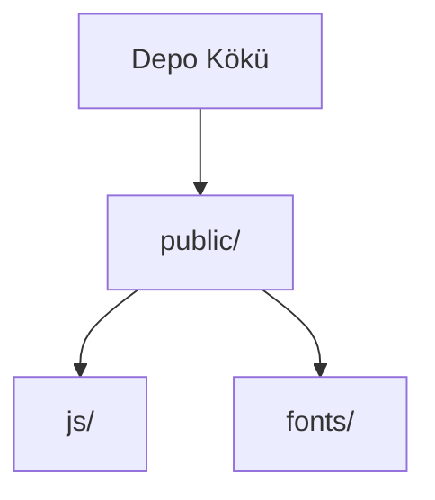

# Birlikte Kardeşlik Derneği Web Platformu

## İçindekiler
* [Özet](#özet)
* [Özellikler](#özellikler)
* [Gereksinimler](#gereksinimler)
* [Kurulum ve çalıştırma](#kurulum-ve-çalıştırma)
* [Yapılandırma](#yapılandırma)
* [Kullanılan teknolojiler](#kullanılan-teknolojiler)
* [Mimari ve klasör yapısı](#mimari-ve-klasör-yapısı)
* [API veya uç noktalar](#api-veya-uç-noktalar)
* [Test ve kalite](#test-ve-kalite)
* [Dağıtım ve üretim notları](#dağıtım-ve-üretim-notları)
* [Katkıda bulunma](#katkıda-bulunma)
* [Lisans](#lisans)

## Özet
Bu proje, Birlikte Kardeşlik Derneği için tek bir çatı altında bir web sitesi ve yönetim paneli sunan dinamik bir Laravel 11 uygulamasıdır. Temel hedefi, dernek faaliyetlerinin, iletişiminin ve içerik yönetiminin kolay ve merkezi bir platform üzerinden yürütülmesini sağlamaktır. Ana işlevler arasında genel site ayarlarının, menülerin, sayfaların, projelerin, haberlerin ve banka hesaplarının dinamik yönetimi bulunmaktadır. Ayrıca, bağış ve gönüllü olma formları gibi etkileşimli özellikler ve detaylı admin aktivite logları da mevcuttur. Rol bazlı yetkilendirme sistemi, farklı kullanıcı tiplerine esnek erişim kontrolü sağlayarak yönetim süreçlerini kolaylaştırır.

## Özellikler
*   Genel site ayarlarının (başlık, logo, favicon, iletişim bilgileri, sosyal medya bağlantıları vb.) yönetim panelinden dinamik olarak yönetilmesi.
*   Dinamik olarak oluşturulabilen menüler, hero slider görselleri, sayfalar, projeler, haberler ve banka hesap bilgileri.
*   Kolay kullanılabilir bağış sayfası ve IBAN kopyalama işlevselliği.
*   Kapsamlı iletişim formu yönetimi: gönderilen verilerin veritabanına kaydedilmesi, yönetim panelinde görüntülenmesi, yöneticilere bildirim e-postası gönderimi ve başvuru sahibine otomatik bilgilendirme e-postası.
*   Esnek gönüllü ol formu: yönetim panelinden yönetilebilen dinamik tercih listeleri, başvuruların veritabanına kaydedilmesi ve yöneticilerin adaylara e-posta ile yanıt verebilmesi.
*   Detaylı admin aktivite logları: yönetici giriş/çıkış, gezinme, veri modeli değişiklikleri gibi eylemlerin kaydedilmesi, filtrelenmesi ve dışa aktarılması.
*   Rol bazlı yetkilendirme sistemi: `super_admin`, `editor` ve `viewer` gibi tanımlı rollerle kullanıcı erişiminin granüler kontrolü.
*   Tamamen Türkçeleştirilmiş yönetim paneli ve kullanıcı arayüzü.
*   PHPMailer entegrasyonu sayesinde SMTP üzerinden güvenli e-posta gönderimi.
*   Üst bar iletişim bilgileri, sosyal medya bağlantıları, mail şablonlarındaki kurumsal bilgiler, gönüllülük alan tercihleri, KVKK ve gönüllü aydınlatma metinleri gibi içeriklerin panelden kolayca yönetilmesi.
*   QR kod oluşturma yeteneği (Endroid QR Code paketi ile).

## Gereksinimler
Projenin sorunsuz çalışması için aşağıdaki yazılım ve servislerin kurulu olması gerekmektedir:

*   **PHP:** Sürüm `^8.2` veya üzeri.
*   **Laravel:** Sürüm `^11.0`.
*   **MySQL:** Veritabanı sunucusu.
*   **Node.js:** Sürüm `^18.0.0 || ^20.0.0 || >=22.0.0` veya üzeri (Frontend bağımlılıkları için).
*   **Composer:** PHP bağımlılık yöneticisi.
*   **npm** (veya Yarn): JavaScript bağımlılık yöneticisi.

## Kurulum ve çalıştırma
Projeyi yerel ortamınızda kurmak ve çalıştırmak için aşağıdaki adımları izleyin:

1.  **Depoyu klonla**
    ```bash
    git clone https://github.com/Burakgul3085/birliktekardeslik.git
    cd birliktekardeslik
    ```

2.  **Bağımlılıkları yükle**
    ```bash
    composer install
    npm install
    ```

3.  **Ortam dosyası ve uygulama anahtarı**
    ```bash
    cp .env.example .env
    php artisan key:generate
    ```

4.  **Veritabanı ayarları**
    `.env` dosyasını açarak MySQL bağlantı bilgilerinizi düzenleyin:
    ```env
    DB_CONNECTION=mysql
    DB_HOST=127.0.0.1
    DB_PORT=3306
    DB_DATABASE=birliktekardeslik
    DB_USERNAME=root
    DB_PASSWORD=root
    DB_CHARSET=utf8mb4
    DB_COLLATION=utf8mb4_unicode_ci
    ```

5.  **Migration ve depolama linki**
    ```bash
    php artisan migrate
    php artisan storage:link
    ```

6.  **Frontend derleme**
    ```bash
    npm run dev
    ```

7.  **Uygulamayı çalıştırma**
    ```bash
    php artisan serve
    ```
    Uygulama artık `http://127.0.0.1:8000` adresinden erişilebilir olacaktır.

**Yönetim Paneli**
Yönetim paneline `http://127.0.0.1:8000/admin` adresinden erişebilirsiniz. İlk yönetici kullanıcıyı oluşturmak için aşağıdaki komutu çalıştırın:
```bash
php artisan make:filament-user
```

**E-posta (PHPMailer) Ayarları**
E-posta gönderimi için `.env` dosyasında aşağıdaki PHPMailer ayarlarını yapılandırmanız gerekmektedir:
```env
PHPMAILER_HOST=smtp.gmail.com
PHPMAILER_PORT=587
PHPMAILER_ENCRYPTION=tls
PHPMAILER_USERNAME=YOUR_EMAIL@gmail.com
PHPMAILER_PASSWORD=YOUR_APPLICATION_PASSWORD
PHPMAILER_FROM_ADDRESS=YOUR_EMAIL@gmail.com
PHPMAILER_FROM_NAME="Birlikte Kardeşlik Derneği"
```
> Not: Gmail için uygulama şifresi kullanılması önerilir.

## Yapılandırma
Projenin temel yapılandırma değişkenleri `.env` dosyasında tanımlanmıştır. Aşağıdaki tabloda önemli değişkenler listelenmektedir:

| Değişken                  | Açıklama                                                       | Zorunlu     |
| :------------------------ | :------------------------------------------------------------- | :---------- |
| `DB_CONNECTION`           | Veritabanı bağlantı türü (ör. `mysql`).                          | Evet        |
| `DB_HOST`                 | Veritabanı sunucusu adresi.                                    | Evet        |
| `DB_PORT`                 | Veritabanı port numarası.                                      | Evet        |
| `DB_DATABASE`             | Kullanılacak veritabanının adı.                                | Evet        |
| `DB_USERNAME`             | Veritabanı kullanıcı adı.                                      | Evet        |
| `DB_PASSWORD`             | Veritabanı parolası.                                           | İsteğe bağlı |
| `DB_CHARSET`              | Veritabanı karakter seti.                                      | Evet        |
| `DB_COLLATION`            | Veritabanı sıralama düzeni.                                    | Evet        |
| `PHPMAILER_HOST`          | SMTP sunucusunun adresi.                                       | Evet        |
| `PHPMAILER_PORT`          | SMTP port numarası.                                            | Evet        |
| `PHPMAILER_ENCRYPTION`    | SMTP şifreleme türü (`tls`, `ssl`).                            | Evet        |
| `PHPMAILER_USERNAME`      | SMTP kullanıcı adı (e-posta adresi).                           | Evet        |
| `PHPMAILER_PASSWORD`      | SMTP uygulama şifresi/parolası.                                | Evet        |
| `PHPMAILER_FROM_ADDRESS`  | Giden e-postaların gönderen adresi.                            | Evet        |
| `PHPMAILER_FROM_NAME`     | Giden e-postaların gönderen adı.                               | Evet        |

## Kullanılan teknolojiler
Bu proje, modern web geliştirme pratiklerini yansıtan güçlü bir teknoloji yığını kullanmaktadır:

| Teknoloji Adı           | Tür            | Açıklama                                                              | Sürüm / Detay          |
| :---------------------- | :------------- | :-------------------------------------------------------------------- | :--------------------- |
| **PHP**                 | Programlama Dili | Sunucu tarafı uygulama mantığı için.                                  | `^8.2`                 |
| **Laravel**             | PHP Framework  | Sağlam ve ölçeklenebilir bir web uygulaması altyapısı sunar.         | `^11.0`                |
| **Filament**            | Admin Paneli   | Hızlı geliştirme ve kolay yönetim sağlayan Laravel admin paneli.     | `^5.6`                 |
| **MySQL**               | Veritabanı     | İlişkisel veri depolama ve sorgulama için.                            | Bağlamda sürüm yok     |
| **PHPMailer**           | PHP Kütüphanesi | SMTP üzerinden e-posta gönderimi için gelişmiş özellikler.            | `^7.0`                 |
| **Endroid QR Code**     | PHP Kütüphanesi | Dinamik QR kod oluşturma yeteneği.                                    | `^6.1`                 |
| **Tailwind CSS**        | CSS Framework  | Hızlı ve esnek UI geliştirme için yardımcı program tabanlı CSS.      | `^3.4.13`              |
| **Alpine.js**           | JS Framework   | Bileşen tabanlı frontend dinamikleri ve etkileşimleri için hafif JS. | `^3.15.11`             |
| **Vite**                | Frontend Tool  | Hızlı derleme ve geliştirme deneyimi sağlayan yeni nesil frontend aracı. | `^5.0`                 |
| **axios**               | JS Kütüphanesi | Tarayıcıda ve Node.js ortamında HTTP istekleri yapmak için Promise tabanlı HTTP istemcisi. | `^1.6.4`               |
| **laravel-vite-plugin** | Vite Plugin    | Laravel ile Vite entegrasyonunu kolaylaştıran özel eklenti.          | `^1.0`                 |

## Mimari ve klasör yapısı
Proje, Laravel Framework'ün standart dizin yapısını takip etmektedir. Ana uygulama mantığı `app/` dizininde yer alırken, genel olarak kullanıcı arayüzüyle ilgili statik varlıklar `public/` dizininde bulunur. Bu düzen, projenin okunabilirliğini ve bakımını kolaylaştırır.

`public/` dizini, web sunucusu tarafından doğrudan erişilebilir olan kök dizindir. Bu dizin içinde, derlenmiş JavaScript dosyaları `public/js/` altında ve web fontları `public/fonts/` altında saklanır.

Aşağıdaki tablo ve akış şeması, projenin üst düzey klasör yapısını ve temel işlevlerini özetlemektedir:

| Bölüm / klasör       | Kısa açıklama                                      |
| :------------------- | :------------------------------------------------- |
| `public`             | Web sunucusu tarafından erişilebilen kök dizin.    |
| `public/js/`         | Derlenmiş JavaScript varlıkları.                   |
| `public/fonts/`      | Web fontları (ör. Filament Inter fontları).        |
| `README.md`          | Proje hakkında genel bilgi ve dokümantasyon.     |
| `composer.json`      | PHP bağımlılıkları ve proje meta verileri.         |
| `package-lock.json`  | Node.js bağımlılık ağacının anlık görüntüsü.      |
| `package.json`       | Node.js bağımlılıkları ve script'ler.              |
| `postcss.config.js`  | PostCSS yapılandırma dosyası (Tailwind CSS için). |



## API veya uç noktalar
Bu proje, hem kullanıcıya yönelik dinamik içerik sunan frontend uç noktalarına hem de yönetim panelini besleyen backend uç noktalarına sahiptir. Laravel'in standart route yapısı kullanıldığından, genel işlevsellik grupları aşağıdaki gibi tahmin edilebilir:

*   **Genel Web Sayfaları:** Dernek hakkında bilgi, projeler, haberler, iletişim ve bağış sayfaları gibi kamuya açık erişilebilir uç noktalar.
*   **İletişim ve Gönüllü Formları:** İletişim ve gönüllü olma başvurularının alınması ve işlenmesi için uç noktalar.
*   **Yönetim Paneli Uç Noktaları:**
    *   `/admin`: Yönetim paneli giriş sayfası.
    *   `/admin/settings`: Genel site ayarları yönetimi.
    *   `/admin/menus`: Menü yönetimi.
    *   `/admin/pages`: Dinamik sayfa yönetimi.
    *   `/admin/projects`: Proje yönetimi.
    *   `/admin/news`: Haber yönetimi.
    *   `/admin/banks`: Banka hesapları yönetimi.
    *   `/admin/contact-forms`: İletişim formu başvurularının görüntülenmesi ve yönetimi.
    *   `/admin/volunteer-forms`: Gönüllü formu başvurularının görüntülenmesi ve yönetimi.
    *   `/admin/users`: Kullanıcı ve rol yetkilendirme yönetimi.
    *   `/admin/activity-logs`: Yönetici aktivite loglarının görüntülenmesi ve filtrelenmesi.

## Test ve kalite
Projenin kalitesini ve işlevselliğini sağlamak amacıyla bazı test ve kalite araçları kullanılmaktadır:

*   **Birim ve Entegrasyon Testleri:**
    *   PHPUnit: Laravel uygulamaları için standart PHP test çatısı (`phpunit/phpunit`).
    *   Test komutu: `php artisan test`
*   **Kod Stili ve Kalitesi:**
    *   Laravel Pint: PHP kod stili denetimi ve otomatik düzeltme aracı (`laravel/pint`).
    *   Bu depoda `composer.json` içinde `laravel/pint` tanımlanmış olmasına rağmen, çalıştırılabilir bir script bulunmamaktadır. Kod stili denetimi ve düzeltme için bir Composer script'i (`"lint": "php artisan pint"`) eklenmesi önerilir.
*   **Frontend Testleri:**
    *   Bu depoda frontend testleri için (`package.json` içinde) özel bir script veya kütüphane (`Jest`, `Vue Test Utils` vb.) tanımlanmamıştır. Frontend bileşenlerinin ve işlevselliğinin kalitesini güvence altına almak için ilgili test framework'lerinin eklenmesi ve test script'lerinin oluşturulması önerilir.

## Dağıtım ve üretim notları
Bu depoda doğrudan dağıtım veya üretim ortamı yapılandırmasına (Dockerfile, docker-compose, Procfile, Nginx yapılandırmaları gibi) dair bilgiler bulunmamaktadır. Üretim ortamına dağıtım için sunucu yapılandırması, ortam değişkenlerinin güvenli bir şekilde yönetilmesi, performans optimizasyonları ve sürekli entegrasyon/sürekli teslimat (CI/CD) süreçleri gibi konuların ayrıntılı olarak dokümante edilmesi önerilir.

## Katkıda bulunma
Projeye katkıda bulunmak ister miseniz, lütfen öncelikle bir `issue` açarak önerinizi veya karşılaştığınız hatayı açıklayın. Ardından, yeni bir `branch` oluşturarak değişikliklerinizi yapın ve bir `pull request` gönderin. Katkılarınız için şimdiden teşekkür ederiz!

## Lisans
Bu proje `MIT` lisansı ile lisanslanmıştır. Daha fazla bilgi için proje kökündeki `LICENSE` dosyasına bakınız.