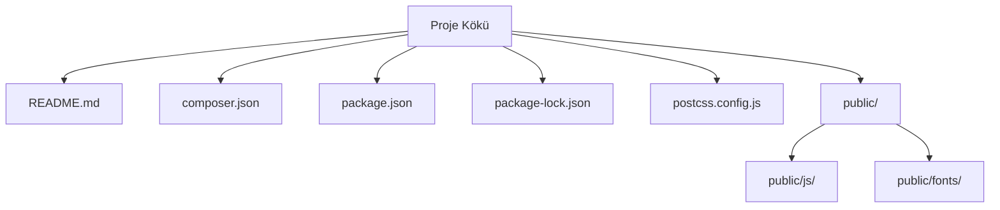

# Birlikte Kardeşlik Derneği Web Platformu

Bu proje, dernek web sitesi ve yönetim panelini tek bir çatı altında toplayan, tamamen dinamik ve admin panelden yönetilebilir bir Laravel 11 uygulamasıdır.

## Proje Özeti

Bu platform, [Birlikte Kardeşlik Derneği](https://github.com/Burakgul3085/birliktekardeslik) için özel olarak geliştirilmiş, dernek faaliyetlerini ve yönetim süreçlerini kolaylaştırmayı amaçlayan kapsamlı bir web çözümüdür. Kullanıcı dostu bir arayüze ve güçlü bir yönetim paneline sahiptir.

**Öne Çıkan Özellikler:**

*   Genel ayarların (site başlığı, logo, favicon, iletişim, sosyal medya vb.) panelden yönetimi
*   Dinamik menü, hero slider, sayfalar, projeler, haberler ve banka hesapları
*   Bağış sayfası ve IBAN kopyalama akışı
*   İletişim formu:
    *   Veritabanına kayıt
    *   Yönetim paneline düşme
    *   Yöneticiye bildirim e-postası
    *   Başvuru sahibine otomatik bilgilendirme e-postası
*   Gönüllü ol formu:
    *   Dinamik tercih listesi (admin panelden yönetilir)
    *   Veritabanına kayıt ve panelde görüntüleme
    *   Yönetici cevabı ile adaya e-posta gönderimi
*   Admin aktivite logları:
    *   Giriş/çıkış, gezinme, model değişiklikleri
    *   Filtreleme ve dışa aktarma
*   Rol bazlı yetkilendirme:
    *   `super_admin`
    *   `editor`
    *   `viewer`
*   Türkçeleştirilmiş yönetim paneli ve kullanıcı arayüzü
*   Dinamik Olarak Panelden Yönetilen Başlıca Alanlar:
    *   Üst bar iletişim bilgileri (telefon, e-posta, adres)
    *   Sosyal medya bağlantıları (Instagram, YouTube, TikTok, Facebook, X)
    *   Mail şablonlarındaki kurumsal bilgiler ve logo
    *   Gönüllülük alan tercihleri
    *   KVKK ve gönüllü aydınlatma metinleri
    *   Banka hesapları ve bağış sayfası verileri

## Kullanılan Teknolojiler

Proje, modern ve esnek bir yapı sunmak için aşağıdaki teknolojileri kullanmaktadır:

*   **Backend**:
    *   [Laravel 11](https://laravel.com/) (PHP Framework)
    *   [Filament](https://filamentphp.com/) (Yönetim Paneli)
    *   PHP 8.2+
    *   [PHPMailer](https://github.com/PHPMailer/PHPMailer) (SMTP Üzerinden E-posta Gönderimi)
    *   [Endroid QR Code](https://github.com/endroid/qr-code)
    *   MySQL (Yerel ve canlı ortam desteği)
*   **Frontend**:
    *   [Tailwind CSS](https://tailwindcss.com/) (CSS Framework)
    *   [Alpine.js](https://alpinejs.dev/) (JavaScript Framework)
    *   [Vite](https://vitejs.dev/) (Frontend Build Tool)
    *   [Autoprefixer](https://github.com/postcss/autoprefixer)
    *   [PostCSS](https://postcss.org/)

## Klasör Yapısı

Aşağıda projenin temel klasör yapısı ve kısa açıklamaları bulunmaktadır:

| Bölüm / klasör         | Kısa açıklama                                |
| :--------------------- | :------------------------------------------- |
| `public/`              | Web sunucusu tarafından erişilen genel dosyolar. |
| `public/js/`           | JavaScript dosyaları (Filament için derlenmiş). |
| `public/fonts/`        | Özel font dosyaları.                         |
| `README.md`            | Proje hakkında genel bilgiler.               |
| `composer.json`        | PHP bağımlılıkları ve proje meta verileri.   |
| `package.json`         | Node.js bağımlılıkları ve scriptler.         |
| `package-lock.json`    | Node.js bağımlılıklarının kilit dosyası.    |
| `postcss.config.js`    | PostCSS yapılandırma dosyası.                |

<details><summary>Detaylı yapı</summary>



```
.
├── public/
│   ├── fonts/
│   │   └── filament/
│   │       └── filament/
│   │           └── inter/
│   │               └── index.css
│   └── js/
│       └── filament/
│           ├── actions/
│           │   └── actions.js
│           ├── filament/
│           │   ├── app.js
│           │   └── echo.js
│           └── forms/
│               ├── components/
│               │   ├── checkbox-list.js
│               │   ├── color-picker.js
│               │   ├── date-time-picker.js
│               │   ├── file-upload.js
│               │   ├── key-value.js
│               │   └── rich-editor.js
├── README.md
├── composer.json
├── package-lock.json
├── package.json
└── postcss.config.js
```

</details>

## Kurulum ve Çalıştırma

Projeyi yerel ortamınızda çalıştırmak için aşağıdaki adımları takip edin.

### 1) Depoyu klonla

```bash
git clone https://github.com/Burakgul3085/birliktekardeslik.git
cd birliktekardeslik
```

### 2) Bağımlılıkları yükle

```bash
composer install
npm install
```

### 3) Ortam dosyası ve uygulama anahtarı

```bash
cp .env.example .env
php artisan key:generate
```

### 4) Veritabanı ayarları

`.env` dosyası içinde MySQL veritabanı bilgilerinizi düzenleyin:

```env
DB_CONNECTION=mysql
DB_HOST=127.0.0.1
DB_PORT=3306
DB_DATABASE=birliktekardeslik
DB_USERNAME=root
DB_PASSWORD=root
DB_CHARSET=utf8mb4
DB_COLLATION=utf8mb4_unicode_ci
```

### 5) Migration ve depolama linki

Veritabanı tablolarını oluşturun ve depolama sembolik linkini kurun:

```bash
php artisan migrate
php artisan storage:link
```

### 6) Frontend derleme

Vite ile frontend varlıklarını derleyin:

```bash
npm run dev
```

### 7) Uygulamayı çalıştırma

Laravel uygulamasını başlatın:

```bash
php artisan serve
```

Uygulamaya `http://127.0.0.1:8000` adresinden erişebilirsiniz.

## Yönetim Paneli

Yönetim paneline `http://127.0.0.1:8000/admin` adresinden erişebilirsiniz.

İlk admin kullanıcısını oluşturmak için aşağıdaki komutu çalıştırın:

```bash
php artisan make:filament-user
```

## E-posta (PHPMailer) Ayarları

E-posta gönderme işlevselliği için `.env` dosyasında PHPMailer ayarlarını yapmanız gerekmektedir:

```env
PHPMAILER_HOST=smtp.gmail.com
PHPMAILER_PORT=587
PHPMAILER_ENCRYPTION=tls
PHPMAILER_USERNAME=ornek@gmail.com
PHPMAILER_PASSWORD=uygulama_sifresi # Gmail için uygulama şifresi kullanılması önerilir.
PHPMAILER_FROM_ADDRESS=ornek@gmail.com
PHPMAILER_FROM_NAME="Birlikte Kardeşlik Derneği"
```

> Not: Gmail için uygulama şifresi kullanılması önerilir. Bu, Google hesabınızın güvenliğini artırır.

## Test

Projeyi test etmek için aşağıdaki komutu kullanabilirsiniz:

```bash
php artisan test
```

## Lisans

Bu proje `MIT` lisansı ile lisanslanmıştır. Daha fazla bilgi için `LICENSE` dosyasına bakınız.