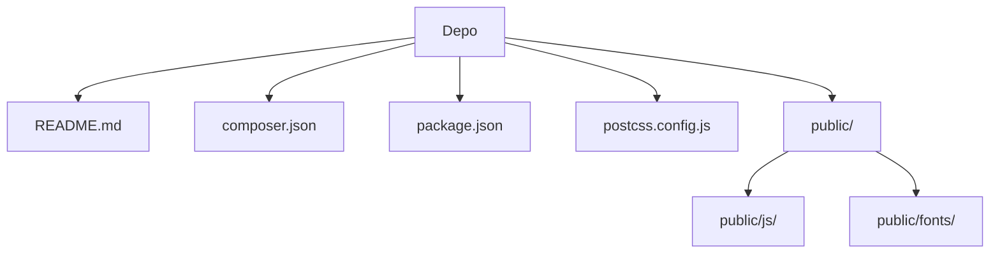

# Birlikte Kardeşlik Derneği Web Platformu

Bu proje, bir derneğin web sitesi ve yönetim panelini tek bir çatı altında toplayan, tamamen dinamik ve admin panelinden yönetilebilir bir Laravel 11 uygulamasıdır. Amacı, dernek üyeleri, gönüllüler ve bağışçılar gibi çeşitli paydaşlarla etkileşimi kolaylaştırmak ve derneğin dijital varlığını güçlendirmektir. Ana işlevleri arasında dinamik içerik yönetimi, form etkileşimleri (iletişim, gönüllülük), bağış kabulü ve kapsamlı bir yönetim paneli bulunmaktadır.

## İçindekiler
* [Özet](#özet)
* [Özellikler](#özellikler)
* [Gereksinimler](#gereksinimler)
* [Kurulum ve çalıştırma](#kurulum-ve-çalıştırma)
* [Yapılandırma](#yapılandırma)
* [Kullanılan teknolojiler](#kullanılan-teknolojiler)
* [Mimari ve klasör yapısı](#mimari-ve-klasör-yapısı)
* [API veya uç noktalar](#api-veya-uç-noktalar)
* [Test ve kalite](#test-ve-kalite)
* [Dağıtım ve üretim notları](#dağıtım-ve-üretim-notları)
* [Katkıda bulunma](#katkıda-bulunma)
* [Lisans](#lisans)

## Özellikler

*   **Dinamik İçerik Yönetimi:** Web sitesi başlığı, logosu, menüler, sayfalar, projeler, haberler ve banka hesapları gibi tüm içerikler yönetim panelinden kolayca düzenlenebilir.
*   **Bağış Toplama:** Entegre bağış sayfası ve IBAN kopyalama özelliği ile bağış toplama süreci kolaylaştırılmıştır.
*   **Etkileşim Formları:** Gelişmiş iletişim ve gönüllü olma formları aracılığıyla kullanıcılarla etkileşim kurulur; başvurular veritabanına kaydedilir ve yöneticilere bildirim gönderilir.
*   **Otomatik E-posta Bildirimleri:** İletişim formu gönderimlerinde yöneticiye bildirim, başvuru sahibine otomatik bilgilendirme e-postaları gönderilir.
*   **Gönüllülük Yönetimi:** Dinamik tercih listeleri ile özelleştirilebilir gönüllü başvuru süreci ve yönetim panelinden adaylara e-posta ile cevap gönderme imkanı sunulur.
*   **Kapsamlı Yönetim Paneli (Filament):** Laravel Filament kullanılarak hızlı ve kolay yönetilebilir bir admin paneli arayüzü sağlanmıştır.
*   **Rol Bazlı Yetkilendirme:** `super_admin`, `editor`, `viewer` gibi farklı rollerle kullanıcı yetkilendirmesi yapılarak panel erişimi kontrol edilir.
*   **Admin Aktivite Logları:** Yönetici giriş/çıkışları, gezinmeler ve model değişiklikleri gibi tüm panel aktiviteleri kaydedilir, filtrelenebilir ve dışa aktarılabilir.
*   **Çok Dilli Destek (Türkçe):** Yönetim paneli ve kullanıcı arayüzü tamamen Türkçeleştirilmiştir.
*   **Modern Frontend:** Tailwind CSS ve Alpine.js ile modern, duyarlı ve etkileşimli bir kullanıcı deneyimi sunulur.
*   **SMTP Destekli E-posta:** PHPMailer kütüphanesi ile güvenilir SMTP üzerinden e-posta gönderimi sağlanır.
*   **Versiyonlama ve Bağımlılık Yönetimi:** `composer.json` ve `package.json` ile PHP ve Node.js bağımlılıkları düzenli bir şekilde yönetilir.

## Gereksinimler

Projenin çalıştırılması için aşağıdaki gereksinimler karşılanmalıdır:

*   **PHP:** Sürüm 8.2 veya üzeri (`composer.json` belirtimi: `^8.2`)
*   **Laravel Framework:** Sürüm 11.x (`composer.json` belirtimi: `^11.0`)
*   **Node.js:** Sürüm 18.0.0, 20.0.0 veya üzeri (`package.json` belirtimi: `^18.0.0 || ^20.0.0 || >=22.0.0`)
*   **npm:** En son stabil sürüm
*   **Veritabanı:** MySQL
*   **Web Sunucusu:** Laravel'i çalıştırmaya uygun bir web sunucusu (örn. Nginx, Apache veya `php artisan serve`)

## Kurulum ve çalıştırma

Projeyi yerel ortamınızda kurmak ve çalıştırmak için aşağıdaki adımları izleyin:

1.  **Depoyu klonlayın:**
    ```bash
    git clone https://github.com/Burakgul3085/birliktekardeslik.git
    cd birliktekardeslik
    ```

2.  **PHP ve Node.js bağımlılıklarını yükleyin:**
    ```bash
    composer install
    npm install
    ```

3.  **Ortam değişkenleri dosyasını oluşturun ve uygulama anahtarını üretin:**
    ```bash
    cp .env.example .env
    php artisan key:generate
    ```

4.  **Veritabanı ayarlarını yapın:**
    `.env` dosyasını açarak MySQL bağlantı bilgilerinizi düzenleyin. Örnek:
    ```env
    DB_CONNECTION=mysql
    DB_HOST=127.0.0.1
    DB_PORT=3306
    DB_DATABASE=birliktekardeslik
    DB_USERNAME=root
    DB_PASSWORD=root
    DB_CHARSET=utf8mb4
    DB_COLLATION=utf8mb4_unicode_ci
    ```

5.  **Veritabanı göçlerini çalıştırın ve depolama bağlantısını oluşturun:**
    ```bash
    php artisan migrate
    php artisan storage:link
    ```

6.  **Frontend varlıklarını derleyin:**
    ```bash
    npm run dev
    ```

7.  **Uygulamayı çalıştırın:**
    ```bash
    php artisan serve
    ```
    Uygulama `http://127.0.0.1:8000` adresinde erişilebilir olacaktır. Yönetim paneli için `http://127.0.0.1:8000/admin` adresine gidin.

8.  **İlk yönetici kullanıcısını oluşturun (isteğe bağlı):**
    ```bash
    php artisan make:filament-user
    ```

9.  **E-posta ayarlarını yapın (isteğe bağlı):**
    `.env` dosyasında PHPMailer için SMTP bilgilerinizi doldurun. Gmail kullanıyorsanız "uygulama şifresi" oluşturmanız önerilir.
    ```env
    PHPMAILER_HOST=smtp.gmail.com
    PHPMAILER_PORT=587
    PHPMAILER_ENCRYPTION=tls
    PHPMAILER_USERNAME=YOUR_GMAIL_ADDRESS
    PHPMAILER_PASSWORD=YOUR_APP_PASSWORD
    PHPMAILER_FROM_ADDRESS=YOUR_GMAIL_ADDRESS
    PHPMAILER_FROM_NAME="Birlikte Kardeşlik Derneği"
    ```

## Yapılandırma

Proje, `.env` dosyası aracılığıyla yapılandırılır. Aşağıda başlıca yapılandırma değişkenleri listelenmiştir:

| Değişken                      | Açıklama                                                                                                     | Zorunlu      |
| :---------------------------- | :----------------------------------------------------------------------------------------------------------- | :----------- |
| `APP_NAME`                    | Uygulamanın adı.                                                                                             | Evet         |
| `APP_ENV`                     | Uygulamanın ortamı (ör. `local`, `production`).                                                              | Evet         |
| `APP_KEY`                     | Uygulamanın şifreleme anahtarı. `php artisan key:generate` ile üretilir.                                     | Evet         |
| `APP_DEBUG`                   | Hata ayıklama modunu etkinleştirir veya devre dışı bırakır.                                                  | Evet         |
| `APP_URL`                     | Uygulamanın temel URL'si.                                                                                    | Evet         |
| `DB_CONNECTION`               | Veritabanı sürücüsü (örn. `mysql`, `pgsql`).                                                                 | Evet         |
| `DB_HOST`                     | Veritabanı sunucusunun adresi.                                                                               | Evet         |
| `DB_PORT`                     | Veritabanı sunucusunun portu.                                                                                | Evet         |
| `DB_DATABASE`                 | Kullanılacak veritabanının adı.                                                                              | Evet         |
| `DB_USERNAME`                 | Veritabanı kullanıcısının adı.                                                                               | Evet         |
| `DB_PASSWORD`                 | Veritabanı kullanıcısının parolası.                                                                          | İsteğe bağlı |
| `PHPMAILER_HOST`              | SMTP sunucusunun adresi.                                                                                     | İsteğe bağlı |
| `PHPMAILER_PORT`              | SMTP sunucusunun portu.                                                                                      | İsteğe bağlı |
| `PHPMAILER_ENCRYPTION`        | SMTP şifreleme türü (örn. `tls`, `ssl`).                                                                     | İsteğe bağlı |
| `PHPMAILER_USERNAME`          | SMTP kimlik doğrulaması için kullanıcı adı.                                                                  | İsteğe bağlı |
| `PHPMAILER_PASSWORD`          | SMTP kimlik doğrulaması için parola.                                                                         | İsteğe bağlı |
| `PHPMAILER_FROM_ADDRESS`      | Gönderilen e-postaların 'Kimden' adresi.                                                                     | İsteğe bağlı |
| `PHPMAILER_FROM_NAME`         | Gönderilen e-postaların 'Kimden' adı.                                                                        | İsteğe bağlı |

## Kullanılan teknolojiler

*   **Backend:**
    *   PHP 8.2+
    *   Laravel 11 (Framework)
    *   Filament (Yönetim Paneli)
    *   PHPMailer (SMTP E-posta Gönderimi)
    *   Endroid/QR-Code (QR kod oluşturma)
*   **Frontend:**
    *   JavaScript
    *   Alpine.js
    *   Tailwind CSS (CSS Framework)
    *   Vite (Frontend Geliştirme Sunucusu/Derleyicisi)
    *   PostCSS, Autoprefixer
*   **Veritabanı:**
    *   MySQL

## Mimari ve klasör yapısı

Proje, Laravel'in standart MVC (Model-View-Controller) mimarisini takip etmektedir. Yönetim paneli için Laravel Filament entegrasyonu sayesinde kaynak yönetimi (CRUD işlemleri) kolayca gerçekleştirilmiştir. Frontend varlıkları (CSS, JS) Vite kullanılarak derlenir ve `public` dizininde sunulur.

Projenin ana yapısı, Laravel'in tipik organizasyonunu yansıtır. `public` dizini, istemciye doğrudan sunulan statik varlıkları içerirken, `composer.json` ve `package.json` gibi kök dizin dosyaları bağımlılıkları ve geliştirme araçlarını tanımlar.

| Bölüm / klasör      | Kısa açıklama                                                                        |
| :------------------ | :----------------------------------------------------------------------------------- |
| `.`                 | Deponun kök dizini; yapılandırma, bağımlılık ve ana proje dosyalarını içerir.      |
| `composer.json`     | PHP bağımlılıkları ve otomatize edilmiş script'ler.                                 |
| `package.json`      | Node.js bağımlılıkları ve frontend derleme script'leri.                              |
| `postcss.config.js` | Tailwind CSS ve Autoprefixer gibi PostCSS eklentilerinin yapılandırması.           |
| `public/`           | Web sunucusu tarafından doğrudan erişilebilen statik varlıklar (CSS, JS, resimler). |
| `public/fonts/`     | Web sitesinde kullanılan font dosyaları.                                             |
| `public/js/`        | Frontend JavaScript dosyaları (Filament, Alpine.js, uygulama özel script'leri).     |
| `README.md`         | Proje hakkında genel bilgi, kurulum ve kullanım talimatları.                       |



## API veya uç noktalar

Proje, hem kullanıcıya yönelik dinamik sayfalar hem de yönetim paneli için çeşitli uç noktalar sunmaktadır:

*   **`GET /`**: Ana sayfa ve dinamik olarak yönetilen içerikler (slider, haberler, projeler vb.).
*   **`GET /iletisim`**: Kullanıcıların dernekle iletişime geçmesini sağlayan iletişim formu sayfası.
*   **`POST /iletisim`**: İletişim formu verilerini işleme uç noktası.
*   **`GET /gonullu-ol`**: Gönüllü başvuru formu sayfası.
*   **`POST /gonullu-ol`**: Gönüllü başvuru formunu işleme uç noktası.
*   **`GET /bagis`**: Bağış yapma sayfasını gösteren uç nokta.
*   **`GET /admin`**: Yönetim paneli giriş sayfası.
*   **`POST /admin/login`**: Yönetim paneli kimlik doğrulama işlemi.
*   **`GET /admin/{resource}`**: Yönetim panelindeki çeşitli kaynakların (örn. `ayarlar`, `menuler`, `sayfalar`, `haberler`, `projeler`, `banka-hesaplari`, `aktivite-loglari`) listeleme, görüntüleme ve düzenleme uç noktaları.

## Test ve kalite

Proje, PHPUnit ile birim ve özellik testleri için temel bir yapı sunmaktadır. Frontend tarafında özel bir test çerçevesi belirtilmemiştir, ancak geliştirme süreçlerinde manuel testler yapılabilir.

*   **Backend Testleri:**
    ```bash
    php artisan test
    ```
    Bu komut, `phpunit/phpunit` tarafından tanımlanan tüm PHP testlerini çalıştırır.
*   **Frontend Testleri:**
    Bu depoda doğrulanmadı; eklenmesi önerilir. JavaScript/CSS için (örneğin Jest, Cypress veya Vue Test Utils gibi) bir test altyapısının eklenmesi önerilir.

## Dağıtım ve üretim notları

Bu projede dağıtım için özel bir `Dockerfile` veya `docker-compose.yml` dosyası bulunmamaktadır. Üretim ortamına dağıtım yaparken aşağıdaki adımların dokümante edilmesi önerilir:

1.  **Ortam Değişkenleri:** Üretim ortamı için `APP_ENV=production` ve `APP_DEBUG=false` gibi uygun `.env` değişkenlerini yapılandırın.
2.  **Veritabanı Yapılandırması:** Üretim veritabanı bağlantı bilgilerini `DB_` değişkenlerinde ayarlayın.
3.  **Frontend Optimizasyonu:** `npm run build` komutuyla frontend varlıklarını üretim için optimize edin.
4.  **Web Sunucusu Yapılandırması:** Nginx veya Apache gibi bir web sunucusunu `public` dizinine işaret edecek şekilde yapılandırın.
5.  **Kuyruk Çalıştırıcıları:** Arka planda çalışan görevler (örn. e-posta gönderimi) için bir kuyruk çalıştırıcı (örneğin, Supervisor veya Laravel Horizon) kurun.
6.  **Önbellek Temizleme:** Dağıtım sonrası `php artisan optimize`, `php artisan config:cache`, `php artisan route:cache`, `php artisan view:cache` gibi komutlarla Laravel önbelleklerini temizleyin ve optimize edin.
7.  **Sertifikalar:** Güvenli iletişim için SSL/TLS sertifikalarını yapılandırın.

## Katkıda bulunma

Projeye katkıda bulunmak isterseniz aşağıdaki adımları takip edebilirsiniz:

1.  Depoyu forklayın.
2.  Yeni bir özellik veya hata düzeltmesi için yeni bir dal oluşturun.
3.  Değişikliklerinizi ekleyin ve açıklayıcı commit mesajları yazın.
4.  Kodunuzun mevcut kodlama standartlarına uyduğundan emin olun.
5.  Değişikliklerinizi içeren bir Pull Request (PR) gönderin.

Geliştirme topluluğumuza katılımınızdan memnuniyet duyarız!

## Lisans

Bu proje `MIT` lisansı ile lisanslanmıştır. Daha fazla bilgi için `LICENSE` dosyasına bakabilirsiniz.