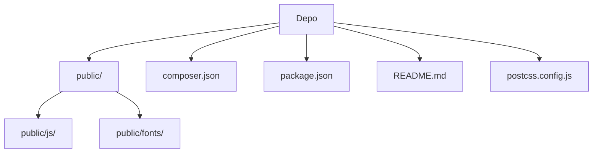

# Birlikte Kardeşlik Derneği Web Platformu

Bu proje, bir derneğin web sitesi ve yönetim panelini entegre bir biçimde sunan, dinamik ve tam yönetilebilir bir web platformudur. Modern Laravel 11 ve Filament mimarisiyle geliştirilmiş olup, derneğin çevrimiçi varlığını etkin bir şekilde yönetmesine olanak tanır. Hedef kullanıcı kitlesi dernek yöneticileri, üyeleri, bağışçılar ve gönüllülerdir. Platform, derneğin içerik yönetimini kolaylaştırmayı, iletişim kanallarını geliştirmeyi ve gönüllülük/bağış süreçlerini otomatikleştirmeyi amaçlamaktadır.

## İçindekiler
* [Özet](#özet)
* [Özellikler](#özellikler)
* [Ekran görüntüsü veya demo](#ekran-görüntüsü-veya-demo)
* [Gereksinimler](#gereksinimler)
* [Kurulum ve çalıştırma](#kurulum-ve-çalıştırma)
* [Yapılandırma](#yapılandırma)
* [Kullanılan teknolojiler](#kullanılan-teknolojiler)
* [Mimari ve klasör yapısı](#mimari-ve-klasör-yapısı)
* [API veya uç noktalar](#api-veya-uç-noktalar)
* [Test ve kalite](#test-ve-kalite)
* [Dağıtım ve üretim notları](#dağıtım-ve-üretim-notları)
* [Katkıda bulunma](#katkıda-bulunma)
* [Lisans](#lisans)

## Özellikler

*   **Dinamik İçerik Yönetimi**: Site başlığı, logo, iletişim bilgileri, sosyal medya bağlantıları gibi genel ayarlar yönetim panelinden kolayca güncellenebilir.
*   **Esnek Menü ve Sayfa Yapısı**: Dinamik menüler, hero slider'lar, sayfalar, projeler, haberler ve banka hesapları yönetim paneli üzerinden oluşturulabilir ve düzenlenebilir.
*   **Bağış ve IBAN Kopyalama**: Özel bağış sayfası ve IBAN kopyalama özelliği ile bağış toplama süreci kolaylaştırılmıştır.
*   **Gelişmiş İletişim Formu**: İletişim formu gönderimleri veritabanına kaydedilir, yönetim paneline düşer, yöneticiye bildirim e-postası gönderilir ve başvuru sahibine otomatik bilgilendirme e-postası iletilir.
*   **Gönüllü Başvuru Yönetimi**: Dinamik gönüllülük tercih listesi (admin panelden yönetilebilir) ile başvuru veritabanına kaydedilir, panelde görüntülenebilir ve yönetici cevabı ile adaya e-posta gönderimi yapılabilir.
*   **Admin Aktivite Kayıtları**: Yöneticilerin giriş/çıkış, gezinme ve model değişiklikleri gibi tüm aktiviteleri loglanır; bu kayıtlar filtrelenebilir ve dışa aktarılabilir.
*   **Rol Bazlı Yetkilendirme**: `super_admin`, `editor` ve `viewer` rolleri ile kullanıcı yetkileri hassas bir şekilde yönetilebilir.
*   **Çok Dilli Yönetim Paneli**: Yönetim paneli ve kullanıcı arayüzü tamamen Türkçeleştirilmiştir.
*   **Teknolojik Altyapı**: Laravel 11, Filament, Tailwind CSS, Alpine.js ve MySQL gibi modern teknolojilerle geliştirilmiştir.
*   **E-posta Entegrasyonu**: PHPMailer kütüphanesi ile SMTP üzerinden güvenli e-posta gönderimi sağlanır.
*   **QR Kod Desteği**: `endroid/qr-code` paketi aracılığıyla QR kod oluşturma yeteneği bulunur.
*   **Vite ile Frontend Geliştirme**: Hızlı ve modern frontend geliştirme için Vite.js kullanılır.

## Ekran görüntüsü veya demo
Ekran görüntüsü veya demo bağlantısı henüz eklenmemiştir. Projenin ana sayfasını, yönetim panelini ve çeşitli form arayüzlerini gösteren görseller eklenmesi faydalı olacaktır.

## Gereksinimler

Bu projeyi yerel ortamınızda çalıştırmak için aşağıdaki yazılımlara ihtiyacınız olacaktır:

*   **PHP**: Sürüm 8.2 veya üzeri (composer.json'dan)
*   **Node.js**: `npm install` ve `npm run dev` komutları Node.js ve npm'in kurulu olduğunu varsayar. Belirli bir sürüm belirtilmemiştir; güncel LTS sürümü önerilir.
*   **Composer**: PHP bağımlılıklarını yönetmek için.
*   **MySQL**: Veritabanı hizmeti.

## Kurulum ve çalıştırma

Projeyi yerel ortamınızda kurmak ve çalıştırmak için aşağıdaki adımları takip edin:

### 1) Depoyu klonla

```bash
git clone https://github.com/Burakgul3085/birliktekardeslik.git
cd birliktekardeslik
```

### 2) Bağımlılıkları yükle

PHP ve Node.js bağımlılıklarını yükleyin:

```bash
composer install
npm install
```

### 3) Ortam dosyası ve uygulama anahtarı

`.env.example` dosyasını kopyalayarak `.env` dosyasını oluşturun ve uygulama anahtarını üretin:

```bash
cp .env.example .env
php artisan key:generate
```

### 4) Veritabanı ayarları

`.env` dosyasını açarak MySQL veritabanı bağlantı bilgilerinizi düzenleyin:

```env
DB_CONNECTION=mysql
DB_HOST=127.0.0.1
DB_PORT=3306
DB_DATABASE=birliktekardeslik # Kendi veritabanı adınızla değiştirin
DB_USERNAME=root             # Kendi veritabanı kullanıcı adınızla değiştirin
DB_PASSWORD=root             # Kendi veritabanı parolanızla değiştirin
DB_CHARSET=utf8mb4
DB_COLLATION=utf8mb4_unicode_ci
```

### 5) Migration ve depolama linki

Veritabanı tablolarını oluşturun ve depolama klasörüne sembolik link oluşturun:

```bash
php artisan migrate
php artisan storage:link
```

### 6) Frontend derleme

Frontend varlıklarını (CSS, JavaScript) derleyin:

```bash
npm run dev
```

### 7) Uygulamayı çalıştırma

Geliştirme sunucusunu başlatın:

```bash
php artisan serve
```

Uygulama `http://127.0.0.1:8000` adresinde erişilebilir olacaktır. Yönetim paneli için `http://127.0.0.1:8000/admin` adresini ziyaret edin.

### 8) İlk yönetici kullanıcı oluşturma

Yönetim paneline erişmek için ilk yönetici kullanıcınızı oluşturun:

```bash
php artisan make:filament-user
```

Komut istemindeki yönergeleri takip ederek kullanıcı adı ve parola belirleyin.

### 9) E-posta (PHPMailer) Ayarları

`.env` dosyasında aşağıdaki PHPMailer ayarlarını yapılandırın (örneğin Gmail için):

```env
PHPMAILER_HOST=smtp.gmail.com
PHPMAILER_PORT=587
PHPMAILER_ENCRYPTION=tls
PHPMAILER_USERNAME=YOUR_GMAIL_ADDRESS@gmail.com
PHPMAILER_PASSWORD=YOUR_APP_PASSWORD
PHPMAILER_FROM_ADDRESS=YOUR_GMAIL_ADDRESS@gmail.com
PHPMAILER_FROM_NAME="Birlikte Kardeşlik Derneği"
```
**Not**: Gmail için uygulama şifresi kullanılması önerilir.

## Yapılandırma

Aşağıdaki ortam değişkenleri `.env` dosyasında yapılandırılmalıdır:

| Değişken | Açıklama | Zorunlu |
| :------------------------- | :------------------------------------------- | :------ |
| `DB_CONNECTION` | Veritabanı sürücüsü. | Evet |
| `DB_HOST` | Veritabanı sunucusu adresi. | Evet |
| `DB_PORT` | Veritabanı bağlantı noktası. | Evet |
| `DB_DATABASE` | Veritabanı adı. | Evet |
| `DB_USERNAME` | Veritabanı kullanıcı adı. | Evet |
| `DB_PASSWORD` | Veritabanı parolası. | Evet |
| `DB_CHARSET` | Veritabanı karakter seti. | Evet |
| `DB_COLLATION` | Veritabanı harmanlama türü. | Evet |
| `PHPMAILER_HOST` | SMTP sunucusu adresi. | Evet |
| `PHPMAILER_PORT` | SMTP bağlantı noktası. | Evet |
| `PHPMAILER_ENCRYPTION` | SMTP şifreleme türü (`tls` veya `ssl`). | Evet |
| `PHPMAILER_USERNAME` | SMTP kullanıcı adı. | Evet |
| `PHPMAILER_PASSWORD` | SMTP parolası (uygulama şifresi). | Evet |
| `PHPMAILER_FROM_ADDRESS` | Gönderen e-posta adresi. | Evet |
| `PHPMAILER_FROM_NAME` | Gönderen adı. | Evet |

## Kullanılan teknolojiler

*   **PHP**
    *   **Laravel 11**: Ana web framework.
    *   **Filament**: Yönetim paneli iskeleti.
    *   **endroid/qr-code**: QR kod oluşturma.
    *   **phpmailer/phpmailer**: SMTP üzerinden e-posta gönderimi.
    *   **laravel/tinker**: Laravel için etkileşimli kabuk.
    *   **laravel/pint**: PHP kod stili sabitleme.
    *   **laravel/sail**: Docker ile Laravel geliştirme ortamı.
    *   **phpunit/phpunit**: PHP test framework'ü.
    *   **spatie/laravel-ignition**: Laravel hata ayıklama sayfası.
*   **JavaScript**
    *   **Node.js / npm**: Bağımlılık yönetimi ve frontend derleme.
    *   **Vite**: Frontend varlık derleyicisi.
    *   **Alpine.js**: Hafif JavaScript framework'ü.
    *   **axios**: HTTP istemcisi.
    *   **laravel-vite-plugin**: Laravel ile Vite entegrasyonu.
*   **CSS**
    *   **Tailwind CSS**: Utility-first CSS framework'ü.
    *   **PostCSS**: CSS dönüştürme aracı.
    *   **Autoprefixer**: CSS ön eklerini otomatik ekler.
*   **Veritabanı**
    *   **MySQL**: İlişkisel veritabanı.

## Mimari ve klasör yapısı

Bu proje, Laravel çerçevesinin standart ve tavsiye edilen klasör yapısını takip eder. `public` dizini, tüm statik varlıkların (CSS, JavaScript, fontlar) sunulduğu kök dizindir. `composer.json` ve `package.json` dosyaları sırasıyla PHP ve Node.js bağımlılıklarını yönetir. Frontend derleme süreçleri `postcss.config.js` ve Vite kullanılarak gerçekleştirilir.

Uygulama, temel web sitesi işlevselliğini ve bir yönetim panelini (Filament ile) tek bir Laravel projesi içinde barındırır. Bu yapı, hem kullanıcı arayüzü hem de yönetimsel görevler için merkezi bir geliştirme ve dağıtım süreci sağlar.

| Bölüm / klasör | Kısa açıklama |
|---|---|
| `/` | Proje kök dizini. |
| `public/` | Web sunucusu tarafından doğrudan erişilebilen statik varlıkları içerir. |
| `public/fonts/` | Web font dosyalarını barındırır. |
| `public/js/` | Derlenmiş JavaScript dosyalarını içerir. |
| `README.md` | Proje hakkında genel bilgiler ve dökümantasyon. |
| `composer.json` | PHP bağımlılıklarını ve proje meta verilerini tanımlar. |
| `package-lock.json` | Node.js bağımlılık ağacının anlık görüntüsü. |
| `package.json` | Node.js bağımlılıklarını ve frontend script'lerini tanımlar. |
| `postcss.config.js` | PostCSS yapılandırma dosyası. |



## API veya uç noktalar

Bu proje, hem kullanıcıya yönelik web sitesi işlevselliği hem de yöneticilere yönelik bir yönetim paneli sunar. Temel uç noktalar ve işlevsellik grupları şunlardır:

*   **Ana Sayfa ve Statik Sayfalar**: Kullanıcılara bilgi sunan genel web sayfaları (`/`, `/hakkimizda`, `/projeler`, `/haberler`).
*   **Bağış Sayfası**: Bağış bilgileri ve IBAN kopyalama işlevselliği (`/bagis`).
*   **İletişim Formu**: Kullanıcıların dernekle iletişime geçmesini sağlayan form gönderim noktası (`/iletisim`).
*   **Gönüllü Başvuru Formu**: Gönüllü olmak isteyenlerin bilgilerini gönderebileceği form (`/gonullu-ol`).
*   **Yönetim Paneli**: Tüm dinamik içeriklerin ve dernek ayarlarının yönetildiği ana panel (`/admin`).
    *   Genel Ayarlar Yönetimi
    *   Menü, Hero Slider, Sayfa Yönetimi
    *   Proje ve Haber Yönetimi
    *   Banka Hesapları Yönetimi
    *   İletişim Formu Başvurularını Görüntüleme
    *   Gönüllü Başvurularını Görüntüleme
    *   Yönetici Aktivite Kayıtları
    *   Kullanıcı ve Rol Yönetimi

## Test ve kalite

Projede temel test komutları mevcuttur.

*   **PHPUnit Testleri**: PHP tarafındaki birim ve özellik testlerini çalıştırmak için:
    ```bash
    php artisan test
    ```
*   **Kod Stili Kontrolü**: Laravel Pint aracı, PHP kod stilini otomatik olarak düzenlemek için kullanılır. Bağlamda açık bir `composer script` tetikleyicisi görünmese de, manuel olarak çalıştırılması önerilir:
    ```bash
    php artisan pint
    ```
*   **Frontend Derlemesi**: Frontend varlıklarının doğru bir şekilde derlendiğinden emin olmak için:
    ```bash
    npm run dev
    ```

## Dağıtım ve üretim notları

Bu depoda üretim ortamına özgü Dockerfile veya dağıtım scriptleri bulunmamaktadır. Üretim ortamına dağıtım yaparken aşağıdaki hususların dokümante edilmesi önerilir:

*   Ortam değişkenlerinin (`.env` dosyası) güvenli bir şekilde yönetilmesi.
*   Veritabanı yedekleme ve kurtarma stratejileri.
*   Önbellekleme (`php artisan optimize`, `php artisan config:cache`, `php artisan route:cache`, `php artisan view:cache`) ve kuyruk (`php artisan queue:work`) süreçlerinin yapılandırılması.
*   Web sunucusu (Nginx/Apache) yapılandırması.
*   Otomatik dağıtım (CI/CD) süreçlerinin entegrasyonu.

## Katkıda bulunma

Bu projeye katkıda bulunmak isterseniz, lütfen bir `issue` açarak önerilerinizi veya bulduğunuz hataları bildirin. Daha sonra bir `pull request` oluşturarak katkıda bulunabilirsiniz. Geliştirme için yeni bir dal (`branch`) oluşturmanız ve değişikliklerinizi bu dal üzerinden yapmanız önerilir.

## Lisans

Bu proje `MIT` lisansı ile lisanslanmıştır. Daha fazla bilgi için proje kök dizinindeki `LICENSE` dosyasına bakabilirsiniz.