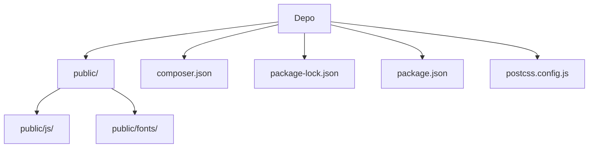

# Birlikte Kardeşlik Derneği Web Platformu

Bu proje, bir derneğin web sitesi ve yönetim panelini tek bir dinamik Laravel 11 uygulaması altında birleştiren kapsamlı bir platformdur. Kullanıcı arayüzü ve içerik yönetimi için güçlü bir yapı sunarken, yönetim paneli aracılığıyla tüm site içeriğinin kolayca güncellenmesine olanak tanır. Platform, derneğin çevrimiçi varlığını güçlendirmeyi, bağış toplama süreçlerini kolaylaştırmayı ve gönüllü etkileşimini artırmayı hedeflemektedir.

## İçindekiler
* [Özet](#özet)
* [Özellikler](#özellikler)
* [Gereksinimler](#gereksinimler)
* [Kurulum ve çalıştırma](#kurulum-ve-çalıştırma)
* [Yapılandırma](#yapılandırma)
* [Kullanılan teknolojiler](#kullanılan-teknolojiler)
* [Mimari ve klasör yapısı](#mimari-ve-klasör-yapısı)
* [API veya uç noktalar](#api-veya-uç-noktalar)
* [Test ve kalite](#test-ve-kalite)
* [Dağıtım ve üretim notları](#dağıtım-ve-üretim-notları)
* [Katkıda bulunma](#katkıda-bulunma)
* [Lisans](#lisans)

## Özellikler
*   **Dinamik İçerik Yönetimi**: Site başlığı, logo, favicon, iletişim bilgileri, sosyal medya bağlantıları gibi genel ayarlar yönetim panelinden kolayca güncellenebilir.
*   **Kapsamlı Sayfa Yönetimi**: Dinamik menü yapıları, "hero slider" alanları, özel sayfalar, projeler, haberler ve banka hesapları yönetim paneli üzerinden yönetilebilir.
*   **Bağış ve IBAN Akışı**: Kullanıcıların kolayca bağış yapabileceği bir sayfa ve IBAN kopyalama işlevi sunar.
*   **İletişim Formu**: Gönderilen iletişim formlarını veritabanına kaydeder, yönetim paneline düşürür ve yöneticiye bildirim e-postası gönderir. Başvuru sahibine otomatik bilgilendirme e-postası da gönderilir.
*   **Gönüllü Başvuru Formu**: Yönetim panelinden yönetilebilen dinamik tercih listeleri sunar, başvuruları veritabanına kaydeder ve panelde görüntüler. Yönetici, adaylara e-posta ile yanıt gönderebilir.
*   **Admin Aktivite Kayıtları**: Yönetici giriş/çıkışlarını, gezinme aktivitelerini ve model değişikliklerini izler; bu kayıtlar filtrelenebilir ve dışa aktarılabilir.
*   **Rol Bazlı Yetkilendirme**: `super_admin`, `editor` ve `viewer` gibi tanımlanmış rollerle kullanıcı yetkileri yönetilebilir.
*   **Türkçeleştirilmiş Arayüz**: Hem yönetim paneli hem de kullanıcı arayüzü tamamen Türkçeleştirilmiştir.
*   **Modern Frontend**: Tailwind CSS ve Alpine.js ile modern ve etkileşimli bir kullanıcı deneyimi sunar.
*   **E-posta Entegrasyonu**: PHPMailer aracılığıyla SMTP üzerinden güvenli e-posta gönderimi sağlar.

## Gereksinimler
Bu projenin başarıyla kurulması ve çalıştırılması için aşağıdaki gereksinimlerin karşılanması gerekmektedir:

*   **PHP**: Minimum sürüm `8.2` (composer.json'da belirtilmiştir).
*   **Node.js**: Minimum sürüm `18.0.0` veya `20.0.0` (package-lock.json'daki `vite` bağımlılığı tarafından belirtilmiştir).
*   **MySQL**: Uygulama için veritabanı.
*   **Composer**: PHP bağımlılıklarını yönetmek için.
*   **npm**: JavaScript bağımlılıklarını yönetmek için.
*   **Bir SMTP Servisi**: E-posta gönderimi için (örneğin Gmail SMTP).

## Kurulum ve çalıştırma

Projeyi yerel ortamınızda kurmak ve çalıştırmak için aşağıdaki adımları izleyin:

1.  **Depoyu klonlayın:**
    ```bash
    git clone https://github.com/Burakgul3085/birliktekardeslik.git
    cd birliktekardeslik
    ```

2.  **Bağımlılıkları yükleyin:**
    ```bash
    composer install
    npm install
    ```

3.  **Ortam dosyasını kopyalayın ve uygulama anahtarını oluşturun:**
    ```bash
    cp .env.example .env
    php artisan key:generate
    ```

4.  **Veritabanı ayarlarını yapılandırın:**
    `.env` dosyasını açın ve MySQL bağlantı bilgilerinizi aşağıdaki gibi güncelleyin:
    ```env
    DB_CONNECTION=mysql
    DB_HOST=127.0.0.1
    DB_PORT=3306
    DB_DATABASE=birliktekardeslik
    DB_USERNAME=root
    DB_PASSWORD=root
    DB_CHARSET=utf8mb4
    DB_COLLATION=utf8mb4_unicode_ci
    ```

5.  **Veritabanı migration'larını çalıştırın ve depolama bağlantısı oluşturun:**
    ```bash
    php artisan migrate
    php artisan storage:link
    ```

6.  **Frontend varlıklarını derleyin:**
    ```bash
    npm run dev
    ```

7.  **Uygulamayı çalıştırın:**
    ```bash
    php artisan serve
    ```

8.  **Yönetim paneli erişimi için ilk kullanıcıyı oluşturun:**
    Tarayıcınızdan `http://127.00.1:8000/admin` adresine gidin. İlk yönetici kullanıcısını oluşturmak için aşağıdaki komutu çalıştırın ve yönergeleri izleyin:
    ```bash
    php artisan make:filament-user
    ```

9.  **E-posta (PHPMailer) ayarlarını yapılandırın:**
    `.env` dosyasında aşağıdaki PHPMailer ayarlarını kendi SMTP bilgilerinizle doldurun:
    ```env
    PHPMAILER_HOST=smtp.gmail.com
    PHPMAILER_PORT=587
    PHPMAILER_ENCRYPTION=tls
    PHPMAILER_USERNAME=YOUR_GMAIL_ADDRESS
    PHPMAILER_PASSWORD=YOUR_APP_PASSWORD
    PHPMAILER_FROM_ADDRESS=YOUR_GMAIL_ADDRESS
    PHPMAILER_FROM_NAME="Birlikte Kardeşlik Derneği"
    ```
    *Not: Gmail için uygulama şifresi kullanılması önerilir.*

## Yapılandırma
Projenin temel yapılandırması `.env` dosyası üzerinden yapılmaktadır. Aşağıdaki önemli değişkenleri kendi ortamınıza göre düzenlemeniz gerekmektedir:

| Değişken                  | Açıklama                                       | Zorunlu    |
| :------------------------ | :--------------------------------------------- | :--------- |
| `DB_CONNECTION`           | Veritabanı sürücüsü (örn. `mysql`)             | Evet       |
| `DB_HOST`                 | Veritabanı sunucusu adresi                     | Evet       |
| `DB_PORT`                 | Veritabanı portu                               | Evet       |
| `DB_DATABASE`             | Kullanılacak veritabanının adı                 | Evet       |
| `DB_USERNAME`             | Veritabanı kullanıcı adı                       | Evet       |
| `DB_PASSWORD`             | Veritabanı parolası                            | Evet       |
| `PHPMAILER_HOST`          | SMTP sunucusunun adresi                        | Evet       |
| `PHPMAILER_PORT`          | SMTP sunucusunun portu                         | Evet       |
| `PHPMAILER_ENCRYPTION`    | SMTP şifreleme türü (örn. `tls`)               | Evet       |
| `PHPMAILER_USERNAME`      | SMTP kullanıcı adı (örn. e-posta adresi)       | Evet       |
| `PHPMAILER_PASSWORD`      | SMTP parola (örn. uygulama şifresi)            | Evet       |
| `PHPMAILER_FROM_ADDRESS`  | Giden e-postaların gönderici adresi            | Evet       |
| `PHPMAILER_FROM_NAME`     | Giden e-postaların gönderici adı               | Evet       |

## Kullanılan teknolojiler

| Kategori       | Teknoloji / Kütüphane     | Açıklama / Sürüm          |
| :------------- | :------------------------ | :------------------------ |
| **Dil**        | PHP                       | ^8.2                      |
|                | JavaScript                | ES6+                      |
| **Çerçeve**    | Laravel                   | 11.x                      |
| **Yönetim Paneli** | Filament Framework      | ^5.6                      |
| **Frontend**   | Tailwind CSS              | ^3.4.13                   |
|                | Alpine.js                 | ^3.15.11                  |
|                | Vite                      | ^5.0                      |
|                | Autoprefixer              | ^10.5.0                   |
|                | PostCSS                   | ^8.5.10                   |
| **Veritabanı** | MySQL                     | Yerel ve canlı ortam desteği |
| **E-posta**    | PHPMailer                 | ^7.0 (SMTP üzerinden e-posta gönderimi) |
| **Diğer PHP Kütüphaneleri** | endroid/qr-code | ^6.1 (QR kod oluşturma)   |
|                               | laravel/tinker    | ^2.9                      |

## Mimari ve klasör yapısı
Proje, Laravel'in standart MVC (Model-View-Controller) mimarisini takip ederken, yönetim paneli için Filament Framework'ü entegre etmiştir. Bu yapı, hem genel web sitesi işlevselliği hem de kapsamlı bir içerik yönetim sistemi arasında net bir ayrım sağlar. Frontend varlıkları (CSS, JS) Vite ile derlenerek modern bir geliştirme akışı sunar.

Aşağıdaki tablo, projenin ana klasörlerini ve dosyalarını açıklamaktadır:

| Bölüm / klasör            | Kısa açıklama                                         |
| :------------------------ | :---------------------------------------------------- |
| `public/`                 | Genel erişime açık web varlıkları (CSS, JS, fontlar). |
| `public/js/`              | Frontend JavaScript dosyaları ve Filament JS varlıkları. |
| `public/fonts/`           | Web sitesinde kullanılan font dosyaları.             |
| `README.md`               | Projenin temel açıklamalarını ve kılavuzunu içerir. |
| `composer.json`           | PHP bağımlılıklarını ve proje meta verilerini tanımlar. |
| `package-lock.json`       | npm bağımlılıklarının tam sürümlerini kilitler.       |
| `package.json`            | JavaScript bağımlılıklarını ve script komutlarını tanımlar. |
| `postcss.config.js`       | PostCSS ve Tailwind CSS yapılandırması.              |

Projenin üst seviye klasör yapısı aşağıdaki gibidir:



## API veya uç noktalar
Bu proje, hem kamuya açık web arayüzleri hem de yönetim paneli işlevleri için çeşitli uç noktalar sunmaktadır:

*   **Ana Sayfa ve Dinamik Sayfalar**: Kullanıcıların erişebileceği ana sayfa, projeler, haberler ve özel sayfalar.
*   **Bağış Sayfası**: Bağış işlemleri için özel bir sayfa ve IBAN kopyalama işlevselliği.
*   **İletişim Formu**: Kullanıcıların dernekle iletişime geçmek için kullanabileceği form gönderim uç noktası.
*   **Gönüllü Ol Formu**: Gönüllü başvuru formunun gönderildiği ve işlendiği uç nokta.
*   **Yönetim Paneli**: Tüm dernek içeriklerinin ve ayarlarının yönetildiği `/admin` öneki altındaki tüm uç noktalar.
*   **E-posta Bildirimleri**: İletişim ve gönüllü formları gönderildiğinde tetiklenen arka plan e-posta bildirim servisleri.

## Test ve kalite
Proje, PHPUnit ile birim ve özellik testlerini desteklemektedir. Frontend varlıkları için linting ve derleme süreçleri mevcuttur.

*   **PHP Testleri**: PHPUnit testlerini çalıştırmak için:
    ```bash
    php artisan test
    ```
*   **Frontend Derleme**: Geliştirme ortamı için frontend varlıklarını izlemek ve derlemek için:
    ```bash
    npm run dev
    ```
*   **Frontend Üretim Derlemesi**: Üretim ortamı için optimize edilmiş frontend varlıklarını derlemek için:
    ```bash
    npm run build
    ```

## Dağıtım ve üretim notları
Bu depoda üretim ortamına özel bir dağıtım yapılandırması (örneğin Dockerfile, docker-compose) doğrulanmamıştır; eklenmesi önerilir. Üretim ortamına dağıtım yaparken, ortam değişkenlerinin doğru şekilde ayarlandığından, önbelleğin temizlendiğinden ve composer'ın optimize edilmiş otomatik yüklemesinin çalıştırıldığından emin olunması önemlidir. Ayrıca, web sunucusu yapılandırması (örneğin Nginx veya Apache) uygulamanın `public` dizinini işaret etmelidir.

## Katkıda bulunma
Projeye katkıda bulunmaktan memnuniyet duyarız. Hata bildirimleri, yeni özellik önerileri veya kod katkıları için lütfen GitHub issues ve pull request mekanizmalarını kullanın. Katkıda bulunmadan önce mevcut issue'lara göz atmanız önerilir.

## Lisans
Bu proje `MIT` lisansı ile lisanslanmıştır. Daha fazla bilgi için `LICENSE` dosyasına bakabilirsiniz.